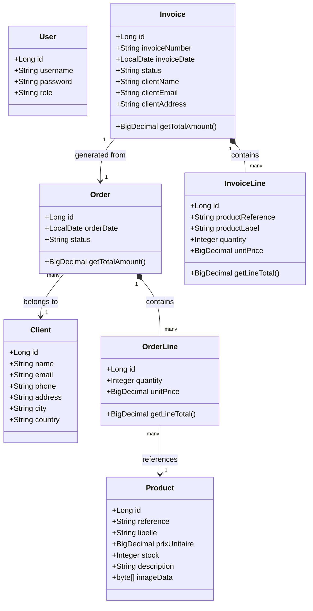

# Rapport de Projet : Mini ERP

Ce document constitue le rapport écrit détaillé du projet "Mini ERP", répondant aux exigences d'analyse et de conception demandées.

---

## 1. Description du contexte métier

Une petite et moyenne entreprise (PME) souhaite moderniser et centraliser la gestion de son activité commerciale. Actuellement, l'entreprise gère ses clients, son catalogue de produits, ses prises de commandes et l'émission de ses factures de manière décentralisée (tableurs, documents textes, etc.), ce qui engendre des erreurs, des pertes de temps et des problèmes de traçabilité.

Le projet **Mini ERP** vise à fournir une application web sur-mesure, simple et centralisée, permettant à l'entreprise de numériser ce flux commercial. Le système doit s'adapter à la structure interne de l'entreprise en distinguant les profils des employés (direction, commerciaux, gestionnaires de stock) afin de sécuriser l'accès aux données.

---

## 2. Analyse des besoins

L'analyse des besoins se divise en deux catégories : fonctionnels et non-fonctionnels.

### Besoins Fonctionnels
- **Gestion des accès et de la sécurité (Authentification & RBAC)** :
  - L'application doit permettre une initialisation sécurisée (création du premier administrateur).
  - Connexion/déconnexion sécurisée par session.
  - Séparation des droits selon 3 rôles : `ADMIN` (accès total), `COMMERCIAL` (clients, commandes, factures) et `STOCK` (catalogue produits).
- **Gestion du catalogue (Produits)** :
  - Maintenir la liste des produits avec référence, prix, description et image.
- **Gestion du carnet d'adresses (Clients)** :
  - Créer, modifier et supprimer les fiches des acheteurs (nom, coordonnées, email).
- **Processus de Vente (Commandes)** :
  - Créer des commandes pour un client contenant de multiples lignes (produits et quantités).
- **Facturation (Invoices)** :
  - Générer informatiquement une facture à partir d'une commande.
  - La facture générée doit servir de document officiel (prêt à l'impression).

### Besoins Non-fonctionnels
- **Technologie** : Backend en Java standard (Jakarta EE 10), sans utilisation de frameworks de haut niveau comme Spring, afin de maîtriser l'architecture interne.
- **Architecture** : Découpage strict en couches (MVC).
- **Base de données** : Relationnelle, gérée par PostgreSQL, interfacée via l'ORM Hibernate (JPA).
- **Interface Utilisateur** : Interface web ergonomique, responsive et moderne (Bootstrap 5).

---

## 3. Diagramme de classes en UML

Le diagramme ci-dessous (au format Mermaid) illustre la structure des entités de la base de données et leurs relations.

*Note sur la conception :* Bien que `OrderLine` référence `Product` et `Order` référence `Client`, l'entité `Invoice` possède ses propres champs textes (snapshots) pour assurer l'immuabilité de la facture, indépendamment des futures modifications du client ou des produits.

---

## 4. Architecture technique

L'application repose sur une **Architecture N-Tiers (MVC)** respectant les standards Jakarta EE :

1. **Couche de Présentation (View)** :
   - Fichiers `JSP` (JavaServer Pages) utilisant la librairie `JSTL` (Jakarta Standard Tag Library) pour l'affichage dynamique.
   - HTML, CSS et JavaScript via le framework CSS Bootstrap 5.
2. **Couche Contrôleur (Controller)** :
   - **Servlets (`HttpServlet`)** : Interceptent les requêtes HTTP (GET/POST), lisent les paramètres, appellent la couche métier, et redirigent ou "forward" vers les vues JSP.
   - **Filtres (`Filter`)** : 
     - `SetupRedirectFilter` : Gère le routage initial si la base est vierge.
     - `AuthFilter` : Implémente le mécanisme de sécurité RBAC (Role-Based Access Control) interdisant l'accès aux routes protégées.
3. **Couche Métier (Service)** :
   - Classes "Service" (`AuthService`, `OrderService`, etc.) isolant les règles de gestion (validation de données, logique de facturation, génération de numéros).
4. **Couche d'Accès aux Données (DAO)** :
   - Classes "DAO" (`ClientDAO`, `ProductDAO`, etc.) encapsulant les interactions avec la base de données.
   - Utilisation stricte de l'`EntityManager` (JPA) pour exécuter les requêtes HQL ou persister les entités.
5. **Couche Modèle (Entity)** :
   - Objets Java annotés (`@Entity`, `@Table`) mappés directement sur les tables PostgreSQL.

---

## 5. Description des règles de gestion

Les règles de gestion (Business Rules) garantissent l'intégrité et la cohérence fonctionnelle du système :

### RG1 : Sécurité et Autorisations
- Un utilisateur non connecté ne peut accéder qu'aux pages publiques (`/login` et `/setup`).
- La suppression d'un compte `User` est interdite si l'utilisateur connecté tente de supprimer son propre compte (prévention du verrouillage total du système).
- Accès compartimenté : Un gestionnaire de stock ne peut pas voir les clients ou les factures. Un commercial ne peut pas modifier le catalogue produit.

### RG2 : Création des Commandes
- Une commande doit obligatoirement être rattachée à un client existant.
- Une commande doit comporter au minimum une ligne de commande valide.
- Une ligne de commande doit avoir une quantité strictement positive (`> 0`).
- **Figeage du prix** : Lors de l'ajout d'un produit à une commande, le prix unitaire du produit est copié dans la `OrderLine`. Ainsi, un changement ultérieur du prix du produit dans le catalogue n'affecte pas les commandes passées.

### RG3 : Immuabilité et Génération des Factures
- **Unicité** : Une commande donnée ne peut générer qu'une et une seule facture.
- **Principe du Snapshot (Photographie)** : La facturation légale exige que le document reste inaltérable. Lors de la création de la facture, les informations du client (Nom, Adresse, Email) et des produits (Référence, Libellé, Prix) sont dupliquées physiquement en dur dans les tables `invoices` et `invoice_lines`. Si un client déménage ou qu'un produit est supprimé du catalogue, la facture restera identique à ce qu'elle était le jour de son émission.
- **Numérotation** : Les factures sont numérotées de façon séquentielle avec une nomenclature annuelle (ex. `FAC-2025-0001`, puis `0002`), calculée automatiquement en comptant les factures existantes pour l'année en cours dans la base de données.